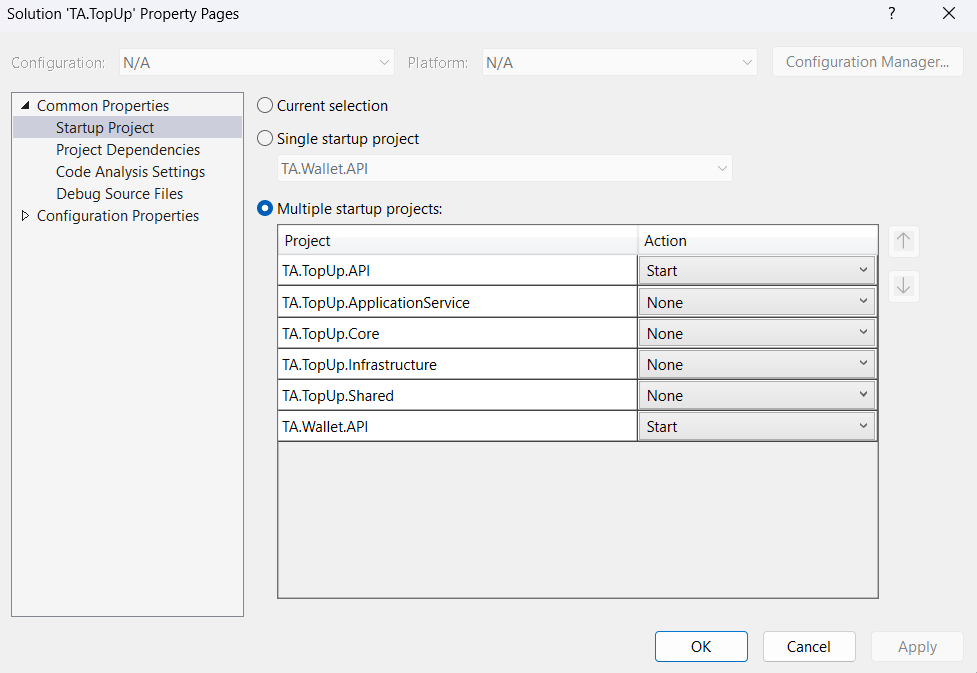

# TopUp Beneficiary Solution - NET6

Created a robust backend solution for the topup beneficiary application, enabling users to efficiently manage their top-up beneficiaries, explore available top-up options, and execute top-up transactions for their UAE phone numbers. Implements a maintainable enterprise-level API application with Middleware, EntityFrameworkCore, Serilog, and Swagger using Domain Driven Design (DDD) and architecture princliples.


## Table of Contents
- [TopUp Beneficiary Solution - NET6](#topup-beneficiary-solution---net6)
  - [Table of Contents](#table-of-contents)
  - [Prerequisites](#prerequisites)
  - [Architecture Overview](#architecture-overview)
  - [Instructions](#instructions)
    - [Installation:](#installation)
    - [Database Setup](#database-setup)
  - [Third Party Libraries](#third-party-libraries)
  - [Future Enhancements](#future-enhancements)


## Prerequisites
You will need the following tools:
* [Visual Studio Code](https://code.visualstudio.com/download) or [Visual Studio 2022](https://visualstudio.microsoft.com/vs/) (version 17.5.0 or later)
* [.NET Core SDK 6.0](https://dotnet.microsoft.com/download/dotnet/6.0)
* Microsoft SQL Server


## Architecture Overview
This is a multi-project solution that utilizes Domain Driven Design (DDD) to create a maintainable web API application using .NET 6 that allows it to run on Linux or Windows and in Docker environments.

## Instructions
### Installation:
1. Install the latest [.NET Core 6 SDK](https://dotnet.microsoft.com/download). 

2. Used Database first approach, so kindly execute the attached SQL script. 

3. Clone Github repo 
   https://github.com/Shivvvvvvvvv/TechnicalAssessment.git

4. Restore Nuget Packages
5. Rebuild and run the program by setting below projects as startup,
    


You should be able to browse and test the application api by using the below URL :

```
Swagger - TopUp Service: https://localhost:7024/swagger/index.html
Swagger - Wallet Service: https://localhost:7085/swagger/index.html

```

### Database Setup
To setup the SQL Server database following the instructions below:
1. Reveiw the **connection string** in **appsettings.json** and update.
2. Execute the Script uploaded in below path
   ./Script/ScriptWithMasterData.sql

## Third Party Libraries
* Serilog

## Future Enhancements
* Implement migration concept to create application database on initial run
* Implement polly 
* Implement ciruit breaker
* Refractor Topup Service
* Write Unit test and Integration test

